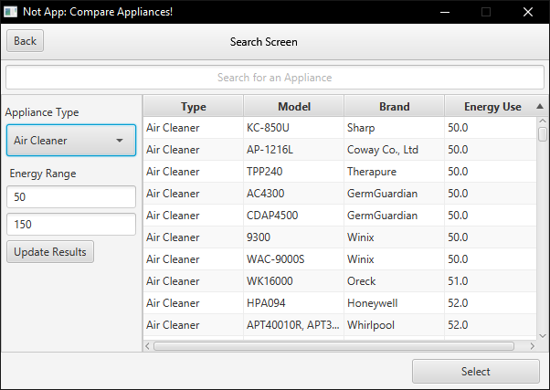
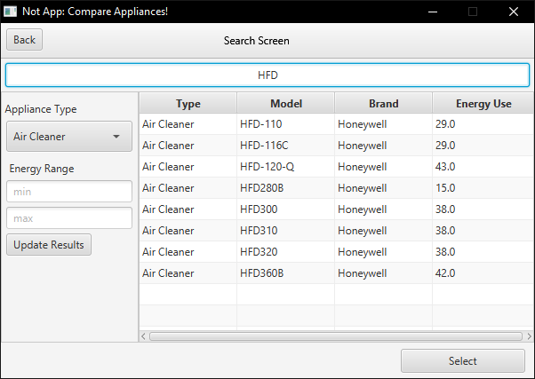
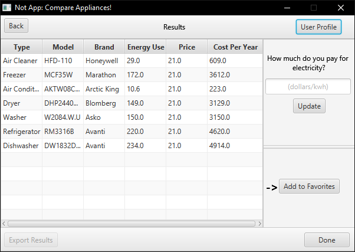
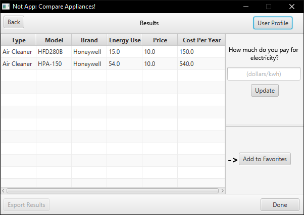
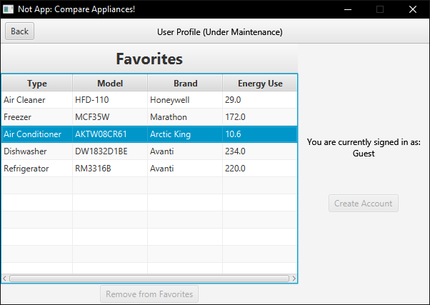
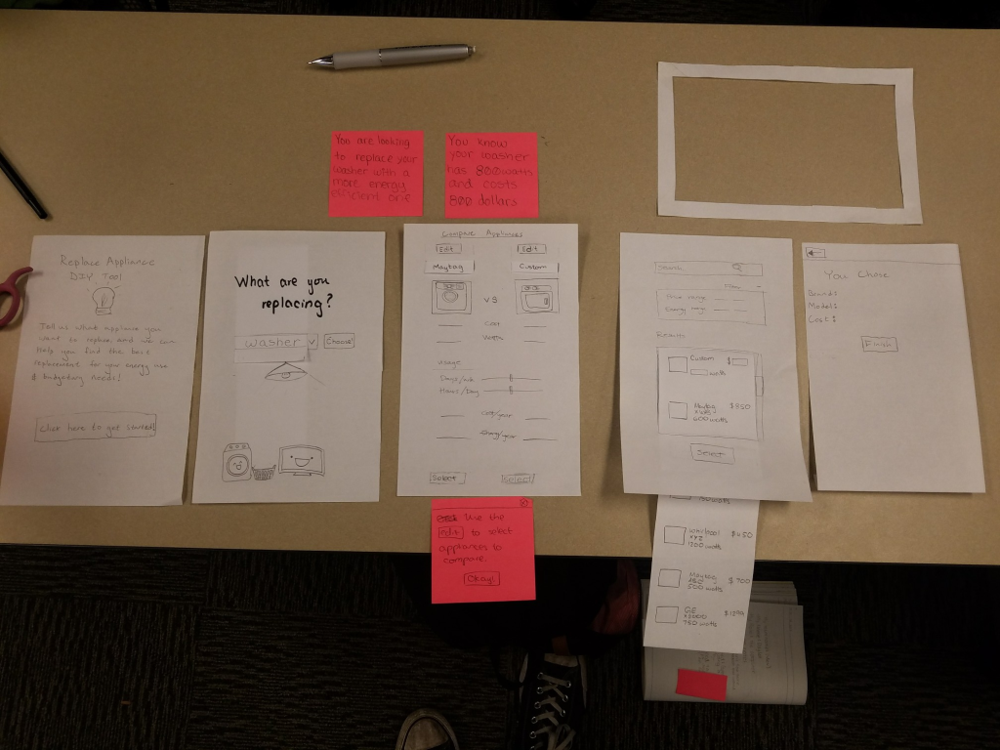
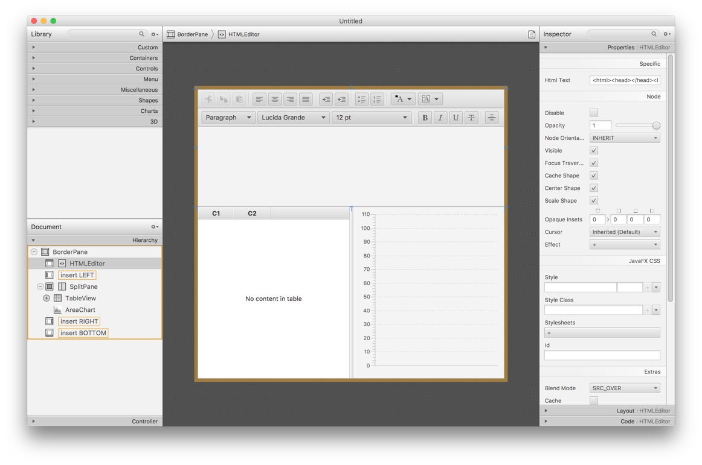
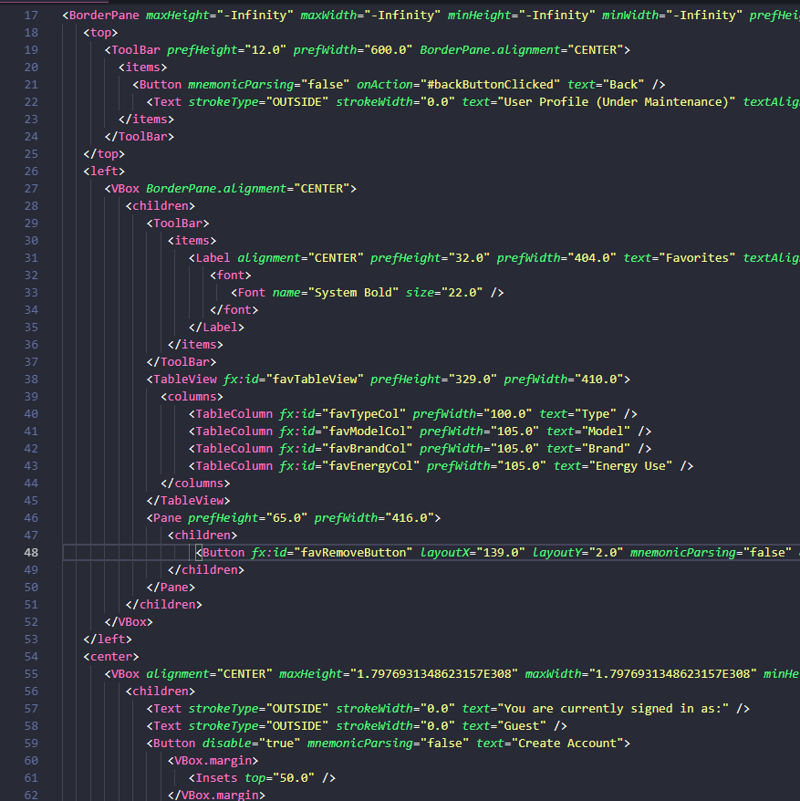
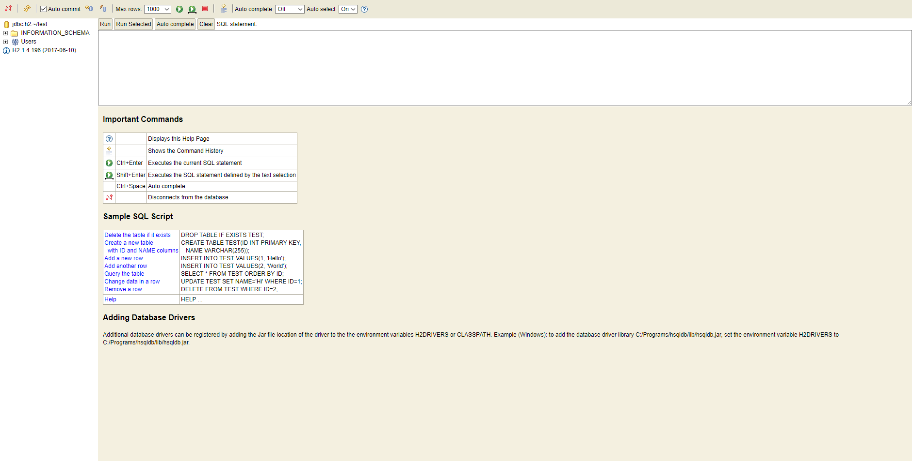

#  ¬ App: Appliance Comparison Program

| Team                                           | ¬Dev:                              |                                     |                                     |                                       |
| ---------------------------------------------- | ---------------------------------- | ----------------------------------- | ----------------------------------- | ------------------------------------- |
| [Michelle](https://github.com/michellesuchang) | [Tim](https://github.com/podoodoo) | [Brandon](https://github.com/Ciyon) | [Devon](https://github.com/DevonS3) | [Daylen](https://github.com/flannyan) |

> A basic application to compare various home appliances, their energy usage and cost.
>
> Created as a team project to develop our skills in UX and software development. 
>
> This program was created through the use of an [**in-memory H2Database**](http://h2database.com/html/main.html) to facilitate our dataset as well as [**JavaFX**](https://docs.oracle.com/javase/8/javafx/get-started-tutorial/index.html) to create our user-interface.

## Requirements
To run this program, you will need to install the latest version of [Java](https://www.java.com/en/download/)

## Running The Program
To start the program you will need to download the repo. Inside the root directory you will find the `notApp.jar`. Simply double click this and the program will execute.

## Table of Contents
- [Features and Functionality](#features-and-functionality)
  * [Search Page](#search-page)
  * [Comparison Page](#comparison-page)
  * [User Profile Page](#user-profile-page)
- [Development Procedure](#development-procedure)
- [Front-End: JavaFX](#front-end-javafx)
- [Back-End: H2Database](#back-end-h2database)

## Features and Functionality

### Search Page

The Search Page provides basic functionality to search through multiple appliance data sources. 

Namely, [the U.S. Department of Energy's Database](https://www.regulations.doe.gov/certification-data/) and [Energy Star's Certified Product Data Sets](https://www.energystar.gov/productfinder/advanced). Additionally, the user is given the option to apply filters to the DB query for: the Appliance Type, Energy Usage, and Model.

| Filter by Energy Usage | Search by Model        |
| ---------------------- | ---------------------- |
|  |  |

### Comparison Page

The comparison page displays the appliances selected through the search page. Furthermore, the user is given the option to input the dollar amount that they pay for each kilowatt hour (kWh).

A **use-case** for this specific page would be to estimate the cost of a collection of products that user owns. Another use case would be to compare two different appliances that the user may consider purchasing.

| Use-Case 1                          | Use-Case 2              |
| :---------------------------------- | :---------------------- |
|  |  |

### User Profile Page

The user page is currently incomplete, although has a functioning favorites page. Which allows users to create a separate list of appliances from the comparison page.

------

## Development Procedure

This was a **Team project** where we had created and designed an application to compare a variety of different appliances and the data that relates to them; such as price, energy cost, name and manufacturer. 

We had **analyzing requirements** as well as created prototypes and mockups through involved UX which had then gone through review through our peers. 

## Front-End: JavaFX

The usage of FXML allowed for our team to quickly develop a non-intimidating, modern looking user-interface. Correspondingly, when working with FXML debugging was relatively painless considering that the syntax is relatable to XML or HTML. 

The **source code for our user-interface** may be accessed through the directory: `\src\fxml\`	

 

> ##### Example FXML Code:
>
>  

## Back-End: [H2Database](http://h2database.com/html/main.html)

H2Database is a **Java SQL database** to which we had opt'd to configure an in-memory database. More specifically, when the program is initially executed the data is loaded from the CSV files contained within the `./database/` directory. This is accomplished, through the `./src/driver/H2Database.java` which is used to interact with the DB server. This includes, connecting to the server, sending queries, parsing the CSVs and other various SQL and DBMS commands.

 
